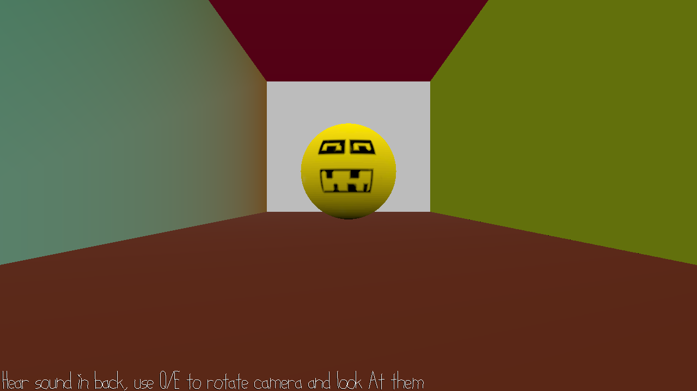

# Monster Watcher

Author: Shengjian Chen

Design: When you hear the warning voice, one monster is breaking out. Try to find it and stare at it.

Screen Shot:

How To Play:

Each 5s, there will be one monster moving. Listen to the warning sound and use Q/E to rotate left/right(I tried to make it slowly turn but ...). Stare at it to make it stop

This game was built with [NEST](NEST.md).
